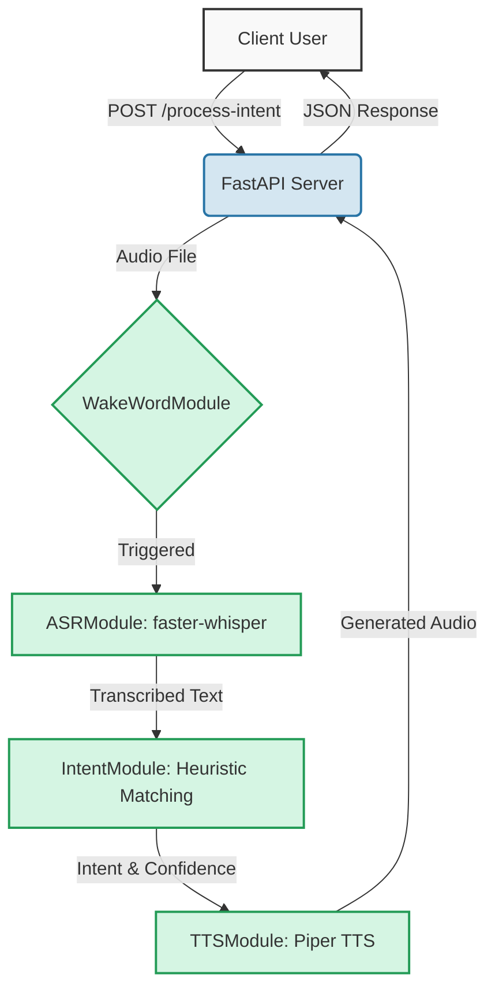
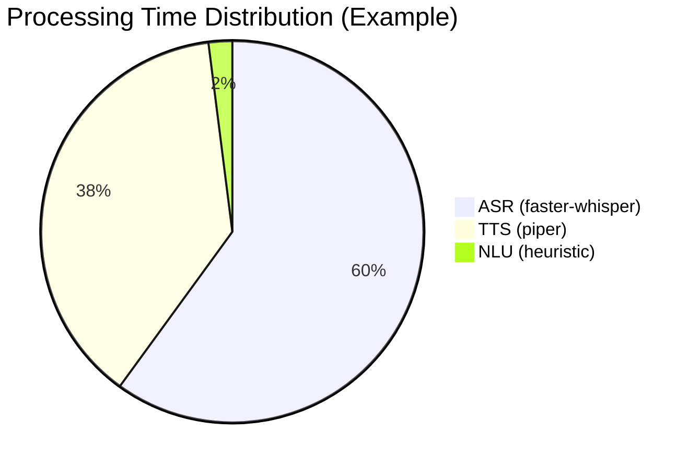
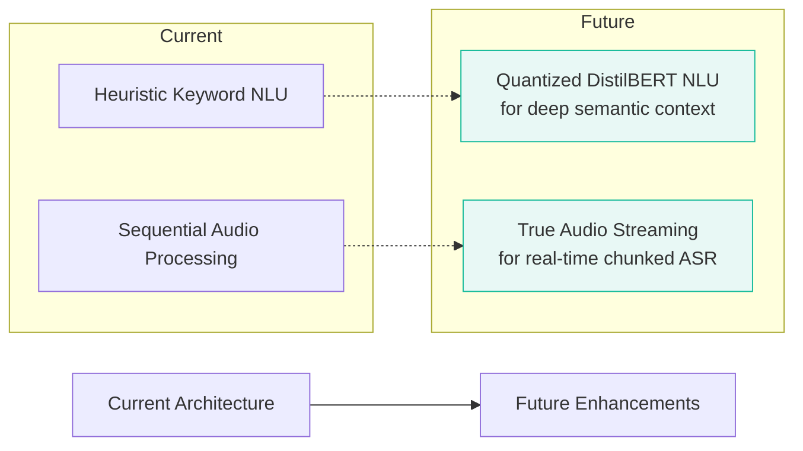

# Real-Time Speech-to-Intent Pipeline


A production-ready voice assistant pipeline built with FastAPI and containerized with Docker. Designed for sub-2-second latency on standard CPUs using high-performance local AI models.

## 🚀 Key Features
- **Local Transcription (ASR)**: `faster-whisper` (tiny.en, int8)
- **Local Intent Classification (NLU)**: Optimized keyword-based heuristic (8 intents)
- **Local Text-to-Speech (TTS)**: `Piper` (Standalone ONNX)
- **Latency Monitoring**: p50/p95/p99 tracking across all stages.
- **Production Infrastructure**: Multi-stage Docker build with zero-intervention startup.

## 🏗️ System Architecture



## 🛠 Prerequisites
- **Hardware**: Minimum 4-core CPU, 8GB RAM (Optimized for standard desktop environments).
- **Software**: Docker & Docker Compose.
- **Assets**: Audio files in `.wav` format (for testing).

## ⚙️ Environment Configuration
Create a `.env` file in the root directory (or use the provided `.env.example`):
```env
# API Config
PORT=8000
HOST=0.0.0.0

# Model Config
ASR_MODEL=tiny.en
INTENT_MODEL=distilbert-base-uncased
TTS_VOICE=en_US-lessac-medium
```

## 📦 Getting Started

### 1. Start the Pipeline
```bash
docker compose up --build -d
```
The first build will take a few minutes as it downloads the model weights (~150MB).

### 2. Verify Service Health
Wait about 60 seconds (for model warm-up) then check:
```bash
curl http://localhost:8000/health
```

### 3. Process Your First Request
```bash
curl -X POST -F "audio=@test_audio.wav" http://localhost:8000/process-intent
```

**Successful API Response (`200 OK`)**:
```json
{
  "transcribed_text": "turn on the lights",
  "intent": "TurnOn",
  "confidence": 0.85,
  "response_audio_b64": "UklGR... (base64 audio data)",
  "latencies_ms": {
    "asr": 450.2,
    "intent": 2.1,
    "tts": 320.5,
    "total": 772.8
  }
}
```

## 📊 Benchmarking

**Target Latency Breakdown (Sub-2s Goal):**


To verify the performance target (<2s p95) on your hardware:
```bash
python benchmark.py
```
This script will run multiple iterations and generate a detailed report in `results/latency_report.json`.

## 📂 Project Structure
```text
.
├── main.py               # FastAPI server and API orchestration
├── asr_module.py         # Speech-to-text integration (faster-whisper)
├── intent_module.py      # Request classification (Heuristic NLU)
├── tts_module.py         # Audio generation (Piper TTS)
├── wake_word_module.py   # Always-on trigger detection
├── benchmark.py          # Performance testing utility
├── Dockerfile            # Multi-stage, optimized container build
└── requirements.txt      # Python dependencies
```

## ⚖️ Model Justification
See [MODEL_CHOICES.md](./MODEL_CHOICES.md) for a detailed breakdown of model rationales and performance targets.

## 🏡 Real-World Use Case: Offline Smart Home
This pipeline is explicitly designed for **privacy-first, offline environments**. By eliminating cloud API dependencies, it guarantees:
- **Zero Network Latency**: No internet bottlenecks.
- **Absolute Privacy**: Voice data never leaves the local network.
- **High Reliability**: Functions perfectly during internet outages.

## 🚧 Challenges Solved
Building a local ML pipeline under strict latency constraints introduced two massive challenges:

1. **Docker Image Mutability**: Relying on runtime downloads for models breaks production reproducibility and causes cold-start delays.
   - *Solution*: A multi-stage Docker build pre-downloads the required ONNX and `faster-whisper` models directly during the build phase, resulting in a perfectly immutable, self-contained container.
2. **Inefficient Disk I/O**: Writing temporary audio files to the disk before processing creates a bottleneck under heavy load.
   - *Solution*: The entire pipeline was refactored to use `io.BytesIO` streams, passing audio data through memory from the FastAPI endpoint down to the TTS generation, eliminating disk writes entirely.
3. **Inference Cold Starts**: Loading models into RAM on the first API request caused massive latency spikes.
   - *Solution*: An asynchronous `@app.on_event("startup")` hook forces a dummy inference pass, pre-warming all models into RAM before the API ever accepts traffic.

## 🔮 Limitations & Future Scope
While highly optimized, the current architecture has areas for future enhancement:



- **Semantic Understanding**: Replacing the fast but simple heuristic intent matcher with a small, quantized language model to handle complex conversational phrasing.
- **True Streaming**: Processing audio chunks in real-time as the user speaks, rather than waiting for the complete file to upload.
